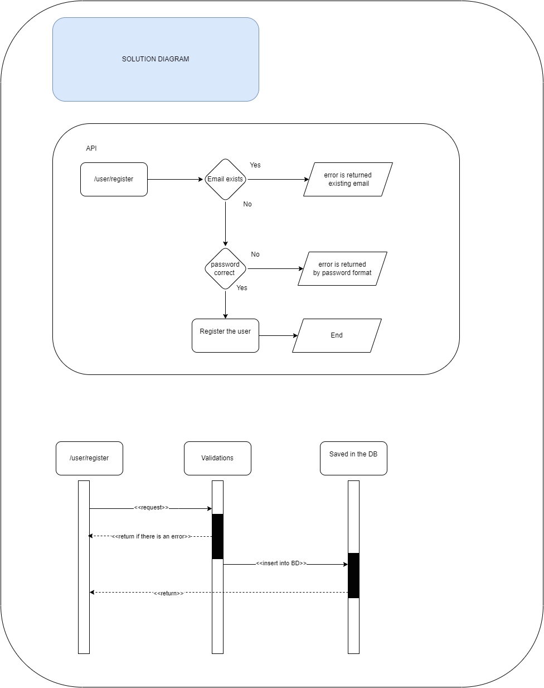

# Register User Microservice API

## Solution Diagram 

## Capabilities

* Business capabilities
    * Register user

## Endpoints

| Endpoints             | Description
|-----------------------|----------------------------------------------------
| POST   /user/register | Process register new user

## Errors

| HTTP Status | message
|-------------|--------------------------
| 403         |  The email is already registered   
| 403         |  The password does not comply with the format     

