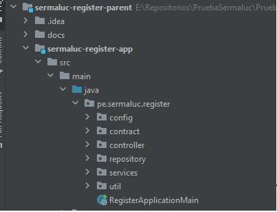
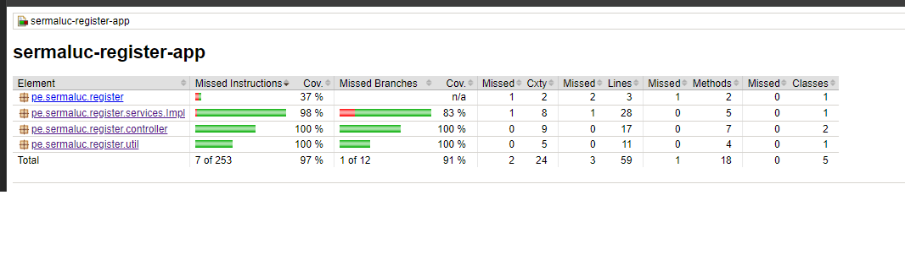
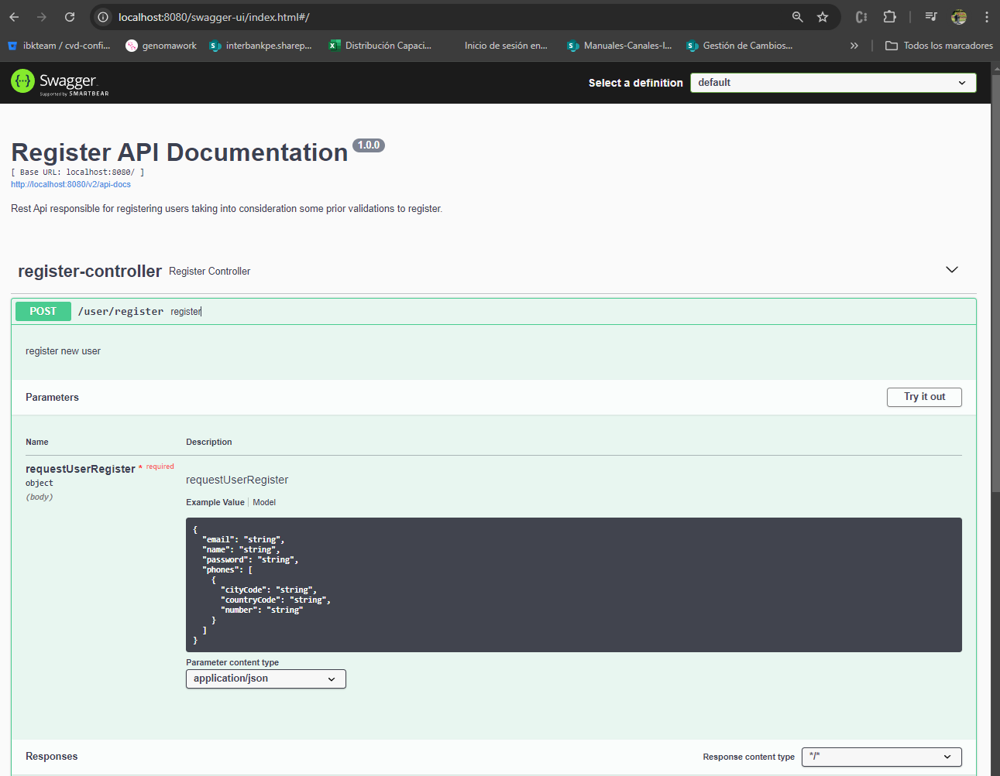
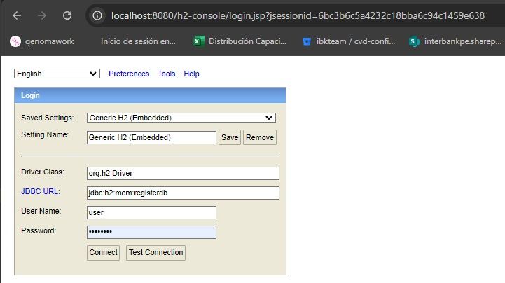

# SERMALUC-REGISTER-USER

## Description

Sermaluc register service it is a microservice in charge of registering new users, having as validations that the email is not repeated and that the password is valid.


## Project structure


```
docs
│
sermaluc-register-parent
 │
 ├── sermaluc-register-app
    │
    ├── config
    │
    ├── contract
    │
    ├── controller
    │
    ├── repository
    │
    ├── services
    │
    ├── util
    
```

## Prerequisites

* Java SDK 11.x
* Maven 3.6.x
* Spring Boot 2.x.x


## Building

```
mvn compile
```

**Executable Jar**

```
mvn verify
```

## Running

Run MicroService within IntelliJ.

## Document Swagger 

Run Microservice 

enter the following url
http://localhost:8080/swagger-ui/index.html#/



## Data Base

http://localhost:8080/h2-console/

Driver Class:
org.h2.Driver

JDBC URL:
jdbc:h2:mem:registerdb

User Name:
user

Password:
sermaluc



## Scripts SQL

CREATE TABLE app_user (
id BIGINT AUTO_INCREMENT PRIMARY KEY,
customer_register VARCHAR(255),
name VARCHAR(255),
email VARCHAR(255),
password VARCHAR(255),
created TIMESTAMP,
modified TIMESTAMP,
last_login TIMESTAMP,
token VARCHAR(255),
active BOOLEAN
);

CREATE TABLE phone (
id BIGINT AUTO_INCREMENT PRIMARY KEY,
number VARCHAR(255),
city_code VARCHAR(255),
country_code VARCHAR(255),
user_id BIGINT,
FOREIGN KEY (user_id) REFERENCES app_user(id) ON DELETE CASCADE
);

